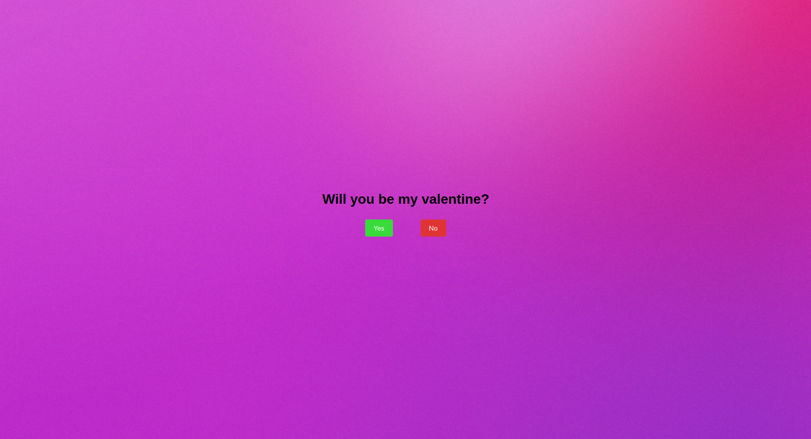
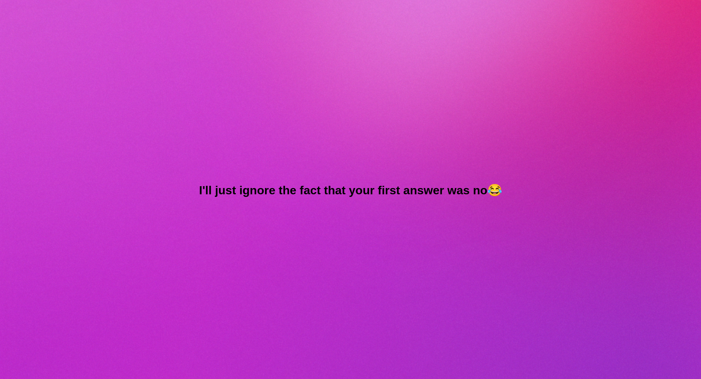

# 💘 val-by-force

A Valentine website that asks a simple question  
and refuses to accept **No** as an answer.

## 🧠 What is this?

`val-by-force` is a playful Valentine project where the user is asked to be your Valentine…  
and the “No” button immediately regrets existing.

The button doesn't work.  
The answer changes.  
Destiny wins.




## ✨ Features

- 💖 A Yes button that stands firm
- 😼 A No button with severe trust issues
- 🏃‍♂️ Dynamic movement to dodge rejection
- 🎨 Simple, cute UI
- ⚡ No backend, no setup, just vibes

## 🛠 Tech Stack

- HTML  
- CSS  
- JavaScript  

## 🚀 How to Run
go to [The website](willubemyval.vercel.app)

or

Clone the repo:

```bash
git clone https://github.com/your-username/val-by-force.git
